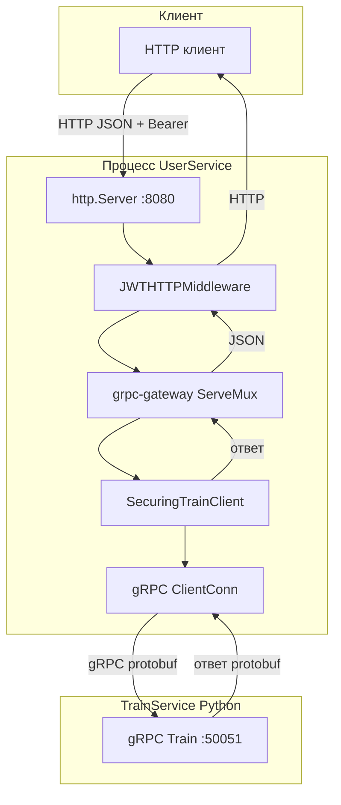
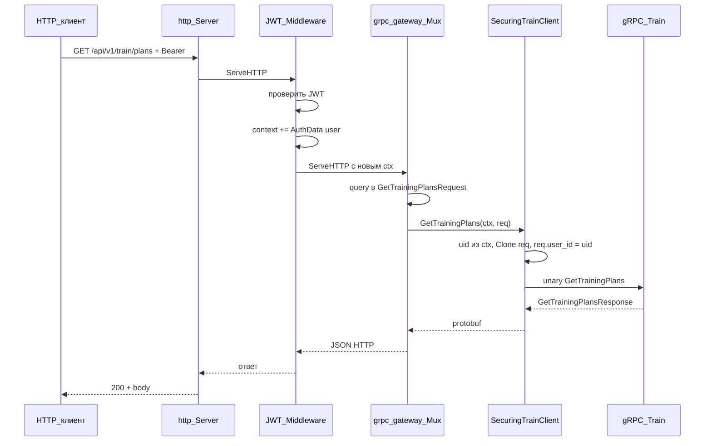
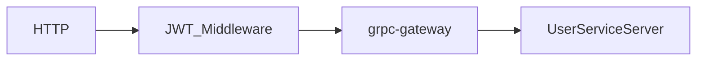

# Поток HTTP → grpc-gateway → Train / User

Кратко: клиент бьёт только в **HTTP `:8080`**. Train доступен по REST, внутри User — gRPC-прокси в Python-сервис.

---

## Общий поток (Train через gateway)

---

## Train: последовательность вызовов

---

## Payment Service (reverse proxy)

Если задан **`PAYMENT_SERVICE_HTTP_URL`** (например `http://host.docker.internal:8000` или `http://payment-service:8000` в общей сети), шлюз проксирует запросы с префикса **`/api/v1/payment`** на PaymentService, **срезая префикс** (как у Payment: `/health`, `/v1/...`, `/webhooks/stripe`).

| Клиент → шлюз `:8080` | Уходит на Payment |
|------------------------|---------------------|
| `GET /api/v1/payment/health` | `GET /health` (без JWT, публичный маршрут) |
| `POST /api/v1/payment/webhooks/stripe` | `POST /webhooks/stripe` (без JWT; Stripe CLI / Stripe → сюда) |
| `POST /api/v1/payment/v1/checkout/subscription` + `Authorization: Bearer …` | `POST /v1/checkout/subscription` + заголовок **`X-User-Id`** из JWT (Bearer **не** пересылается downstream) |

Остальные пути под `/api/v1/payment/` — с **JWT**, как и остальной API.

Код: `service/internal/transport/gateway/payment_proxy.go`, регистрация в `service/cmd/main.go`, публичные пути в `middleware.go` (`IsPublicHTTPRoute`).

---

## Маршруты User (in-process, без gRPC-клиента наружу)

Тот же HTTP вход и middleware; после mux вызывается **`UserServiceServer`** в том же процессе.

---

## Где в коде

| Узел | Файл |
|------|------|
| HTTP + обёртка middleware | `service/cmd/main.go` |
| JWT на HTTP | `service/internal/transport/gateway/middleware.go` |
| Подстановка `user_id` для Train | `service/internal/transport/trainclient/securing.go` |
| Прокси на Payment | `service/internal/transport/gateway/payment_proxy.go` |

---

## Порты

| Сервис | Порт | Протокол |
|--------|------|-----------|
| Публичный API (gateway) | `8080` (env `HTTP_ADDR`) | HTTP |
| Прямой gRPC User (опционально) | `9090` (env `GRPC_ADDR`) | gRPC |
| Train | `50051` (env `TRAIN_GRPC_ADDR`) | gRPC |
